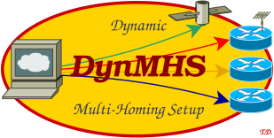

# Dynamic Multi-Homing Setup&nbsp;(DynMHS)

<p align="center">
 <a href="https://www.nntb.no/~dreibh/dynmhs/">
 <br />
 https://www.nntb.no/~dreibh/dynmhs/
 </a>
</p>

## Description

DynMHS dynamically sets up IP routing rules, to allow using multiple network
connections simultaneously. That is, for each relevant network interface, a
separate routing table is created and maintained. For each source address of a
network interface managed by DynMHS, routing rules are maintained to point to
the corresponding routing table. Software binding to a specific interface
address can then use a specific network. In addition, multi-homing-capable
network protocols like the Multi-Path TCP (MPTCP) or the Stream Control
Transmission Protocol (SCTP) can take advantage of multi-homing for redundancy
and load balancing.

See the manpage of dynmhs for details!

## Example

### Scenario

A Linux PC is connected to two NAT networks, configuration via DHCP and IPv6 auto-configuration:

* Network #1 on interface enp0s8: 172.30.255.4 / fdff:b44d:605c:0:a00:27ff:fedb:ad69
* Network #2 on interface enp0s9: 192.168.255.4 / fdc9:dc25:8e35:0:a00:27ff:feaa:bc91

Network settings using [Netplan](https://netplan.io/) (in /etc/netplan/testpc.yaml):
```
network:
  version: 2
  ethernets:
    enp0s8:
      accept-ra: true
      dhcp4: true
      dhcp4-overrides:
        route-metric: 200
    enp0s9:
      accept-ra: true
      dhcp4: true
      dhcp4-overrides:
        route-metric: 300
```

IPv4 Routes:
```
user@testpc:~$ ip -4 route show
default via 172.30.255.1 dev enp0s8 proto dhcp src 172.30.255.4 metric 200
default via 192.168.255.1 dev enp0s9 proto dhcp src 192.168.255.4 metric 300
172.30.255.0/24 dev enp0s8 proto kernel scope link src 172.30.255.4 metric 200
172.30.255.1 dev enp0s8 proto dhcp scope link src 172.30.255.4 metric 200
192.168.255.0/24 dev enp0s9 proto kernel scope link src 192.168.255.4 metric 300
192.168.255.1 dev enp0s9 proto dhcp scope link src 192.168.255.4 metric 300
```
IPv6 Routes:
```
user@testpc:~$ ip -6 route show
fc88:1::/64 dev hostonly101 proto kernel metric 256 linkdown pref medium
fdc9:dc25:8e35::/64 dev enp0s9 proto ra metric 300 pref medium
fdff:b44d:605c::/64 dev enp0s8 proto ra metric 200 pref medium
fe80::/64 dev enp0s8 proto kernel metric 256 pref medium
fe80::/64 dev enp0s9 proto kernel metric 256 pref medium
default via fe80::5054:ff:fe12:3500 dev enp0s8 proto ra metric 200 expires 788sec pref medium
default via fe80::5054:ff:fe12:3500 dev enp0s9 proto ra metric 300 expires 772sec pref medium
```

Note the two default routes with the different metrics (200, 300).

### Why is it not working as expected?

A test with [HiPerConTracer 2.0](https://www.nntb.no/~dreibh/hipercontracer/), running HiPerConTracer Ping to the Google DNS servers from all four source addresses:
```
sudo hipercontracer -P \
   -S 172.30.255.4 -S 192.168.255.4 \
   -S fdff:b44d:605c:0:a00:27ff:fedb:ad69 -S fdc9:dc25:8e35:0:a00:27ff:feaa:bc91 \
   -D 8.8.8.8 -D 2001:4860:4860::8888
```
Connectivity is always over the primary interface, i.e.&nbsp;172.30.255.4 and&nbsp;fdff:b44d:605c:0:a00:27ff:fedb:ad69. The reason is: This default route has the lowest metric! Also, simply using the same metric for both routes does not work as well. Then, just the first default route in the routing table would get used.

To get the setup working as expected, it is necessary to configure separate routing tables for each network, and routing rules to select a routing table according to the *source* IP address:

* Rule 2000: for packets from 172.30.255.4 use routing table #2000.
* Rule 2000: for packets from fdff:b44d:605c:0:a00:27ff:fedb:ad69 use routing table #2000.
* Rule 3000: for packets from 192.168.255.4 use routing table #3000.
* Rule 3000: for packets from fdc9:dc25:8e35:0:a00:27ff:feaa:bc91 use routing table #3000.

Rules:
```
user@testpc:~$ ip rule show
0:      from all lookup local
2000:   from 172.30.255.4 lookup 2000
3000:   from 192.168.255.4 lookup 3000
32766:  from all lookup main
32767:  from all lookup default

user@testpc:~$ ip -6 rule show
0:      from all lookup local
2000:   from fdff:b44d:605c:0:a00:27ff:fedb:ad69 lookup 2000
3000:   from fdc9:dc25:8e35:0:a00:27ff:feaa:bc91 lookup 3000
32766:  from all lookup main
```

Tables:
```
user@testpc:~$ ip route show table 2000
default via 172.30.255.1 dev enp0s8 proto dhcp src 172.30.255.4 metric 200
172.30.255.0/24 dev enp0s8 proto kernel scope link src 172.30.255.4 metric 200
172.30.255.1 dev enp0s8 proto dhcp scope link src 172.30.255.4 metric 200

user@testpc:~$ ip -6 route show table 2000
fdff:b44d:605c::/64 dev enp0s8 proto ra metric 200 pref medium
fe80::/64 dev enp0s8 proto kernel metric 256 pref medium
default via fe80::5054:ff:fe12:3500 dev enp0s8 proto ra metric 200 pref medium

user@testpc:~$ ip route show table 3000
default via 192.168.255.1 dev enp0s9 proto dhcp src 192.168.255.4 metric 300
192.168.255.0/24 dev enp0s9 proto kernel scope link src 192.168.255.4 metric 300
192.168.255.1 dev enp0s9 proto dhcp scope link src 192.168.255.4 metric 300

user@testpc:~$ ip -6 route show table 3000
fdc9:dc25:8e35::/64 dev enp0s9 proto ra metric 300 pref medium
fe80::/64 dev enp0s9 proto kernel metric 256 pref medium
default via fe80::5054:ff:fe12:3500 dev enp0s9 proto ra metric 300 pref medium
```

It is possible to configure *static* rules/tables in Netplan. But DHCP and IPv6 auto-configuration use *dynamic* addresses. So, they may change!

### Applying DynMHS

Dynamic Multi-Homing Setup&nbsp;(DynMHS) is the solution for dynamically creating, adapting, and destroying routing tables and rules. It monitors the system's network configuration for changes, and applies the necessary settings for additional routing tables and the corresponding routing rules. This works for IPv4 and IPv6, including multiple addresses as well as additional routes over the monitored interfaces.

#### Manual usage

```
sudo dynmhs --interface enp0s8:2000 --interface enp0s9:3000 --loglevel 2
```

#### As SystemD service

Configuration in /etc/dynmhs/dynmhs.conf:
```
# ====== Logging Verbosity ==================================================
# 0=trace, 1=debug, 2=info, 3=warning, 4=error, 5=fatal
LOGLEVEL=2

# ====== Options ============================================================
NETWORK1="enp0s8:2000"
NETWORK2="enp0s9:3000"
NETWORK3=""
NETWORK4=""
NETWORK5=""
```

To enable and start:
```
sudo systemctl daemon-reload
sudo systemctl enable dynmhs
sudo systemctl start dynmhs
```

To observe the logs:
```
sudo journalctl -f -u dynmhs
```

##### A HiPerConTracer Ping test

A test with [HiPerConTracer 2.0](https://www.nntb.no/~dreibh/hipercontracer/):
```
sudo hipercontracer -P \
   -S 172.30.255.4 -S 192.168.255.4 \
   -S fdff:b44d:605c:0:a00:27ff:fedb:ad69 -S fdc9:dc25:8e35:0:a00:27ff:feaa:bc91 \
   -D 8.8.8.8 -D 2001:4860:4860::8888
```

## Binary Package Installation

Please use the issue tracker at https://github.com/simula/dynmhs/issues to report bugs and issues!

### Ubuntu Linux

For ready-to-install Ubuntu Linux packages of DynMHS, see Launchpad PPA for Thomas Dreibholz!

```
sudo apt-add-repository -sy ppa:dreibh/ppa
sudo apt-get update
sudo apt-get install dynmhs
```

### Fedora Linux

For ready-to-install Fedora Linux packages of DynMHS, see COPR PPA for Thomas Dreibholz!

```
sudo dnf copr enable -y dreibh/ppa
sudo dnf install dynmhs
```

## Sources Download

DynMHS is released under the GNU General Public Licence (GPL).

Please use the issue tracker at https://github.com/simula/dynmhs/issues to report bugs and issues!

### Development Version

The Git repository of the DynMHS sources can be found at https://github.com/simula/dynmhs:

- Issue tracker: https://github.com/simula/dynmhs/issues.
  Please submit bug reports, issues, questions, etc. in the issue tracker!

- Pull Requests for DynMHS: https://github.com/simula/dynmhs/pulls.
  Your contributions to DynMHS are always welcome!

- CI build tests of DynMHS: https://github.com/simula/dynmhs/actions.

### Current Stable Release

See https://www.nntb.no/~dreibh/dynmhs/#Download!
